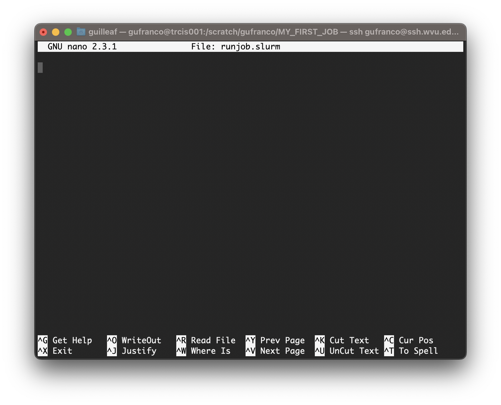

:::::::::::::::::::::::::::::::::::::: questions

- "Which are the typical steps to execute a job on an HPC cluster?"
- "Why I need to learn commands, edit files and submit jobs?"

::::::::::::::::::::::::::::::::::::::::::::::::

::::::::::::::::::::::::::::::::::::: objectives

- "Execute step by step the usual procedure to run jobs on an HPC cluster"

::::::::::::::::::::::::::::::::::::::::::::::::

## The Life Cycle of a Job

In this episode will will follow some typical steps to execute a calculation using an HPC cluster.
The idea is not to learn at this point the commands. Instead the purpose is to provide a reason to why the commands we will learn in future episodes are important to learn and grasp an general perspective of what is involved in using an HPC to carry out research.

We will use a case very specific in Physics, more in particular in Materials Science. We will compute the atomic and electronic structure of Lead in crystalline form. Do not worry about the techical aspects of the particular application, similar procedures apply with small variations in other areas of science: chemistry, bioinformatics, forensics, health sciences and engineering.

### Creating a folder for my first job.

The first step is to change our working directory to a location where we can work. Each user has a **scratch** folder, a folder where you can write files, is visible across all the nodes of the cluster and you have enough space even when large amounts of data are used as inputs or generated as output.

```
~$ cd $SCRATCH
```
I will create a folder there for my first job and move my working directory inside the newly created folder.

```
~$ mkdir MY_FIRST_JOB
~$ cd MY_FIRST_JOB
```

### Getting an input file for my simulation

Many scientific codes use the idea of an **input file**. An input file is just a file or set of files that describe the problem that will be solved and the conditions under which the code should work during the simulation. Users are expected to write their input file, in our case we will take one input file that is ready for execution from one of the examples from a code called ABINIT. ABINIT is a software suite to calculate the optical, mechanical, vibrational, and other observable properties of materials using a technique in applied quantum mechanics  called density functional theory. The following command will copy one input file that is ready for execution.

```
~$ cp /shared/src/ABINIT/abinit-9.8.4/tests/tutorial/Input/tbasepar_1.abi .
```

We can confirm that you have the file in the current folder

```
~$ ls
tbasepar_1.abi
```

and get a pick into the content of the file

```
~$ cat tbasepar_1.abi 
#
# Lead crystal
#

#Definition of the unit cell
acell 10.0 10.0 10.0
rprim
    0.0  0.5  0.5
    0.5  0.0  0.5
    0.5  0.5  0.0

#Definition of the atom types and pseudopotentials
ntypat 1
znucl  82
pp_dirpath "$ABI_PSPDIR"
pseudos "Pseudodojo_nc_sr_04_pw_standard_psp8/Pb.psp8"

#Definition of the atoms and atoms positions
natom  1
typat  1 
xred
  0.000   0.000   0.000

#Numerical parameters of the calculation : planewave basis set and k point grid
ecut  24.0
ngkpt 12 12 12
nshiftk 4
shiftk
   0.5 0.5 0.5
   0.5 0.0 0.0
   0.0 0.5 0.0
   0.0 0.0 0.5
occopt 7
tsmear 0.01
nband  7

#Parameters for the SCF procedure
nstep   10
tolvrs  1.0d-10

##############################################################
# This section is used only for regression testing of ABINIT #
##############################################################
#%%<BEGIN TEST_INFO>
#%% [setup]
#%% executable = abinit
#%% [files]
#%% files_to_test = tbasepar_1.abo, tolnlines=0, tolabs=0.0, tolrel=0.0
#%% [paral_info]
#%% max_nprocs = 4
#%% [extra_info]
#%% authors = Unknown
#%% keywords = NC
#%% description = Lead crystal. Parallelism over k-points
#%%<END TEST_INFO>
```

In this example, a single file contains all the input needed. Some other files are used but the input provides instructions to locate those extra files. We are ready to write the submission script

### Writing a submission script

A submission script is just a text file that provide information about the resources needed to carry out the simulation that we pretend to execute on the cluster. We need to create text file and for that we will use a terminal-based text editor. The simplest to use is called `nano` and for the purpose of this tutorial it is more than enough.

```
~$ nano runjob.slurm
```

{alt="nano text editor" width='90%'}

Type the following inside **nano** window and leave the editor using the command <kbd>Ctrl</kbd>+<kbd>X</kbd>.

```bash
#!/bin/bash

#SBATCH --job-name=lead
#SBATCH --nodes=1
#SBATCH --cpus-per-task=1
#SBATCH --ntasks=4
#SBATCH --partition=standby
#SBATCH --time=4:00

module purge
module load atomistic/abinit/9.8.4_intel22_impi22

mpirun -np 4 abinit tbasepar_1.abi
```

### Submitting the job

We use the submission script we just wrote to request the HPC cluster to execute our job when resources on the cluster became available.
The job is very small so it is very likely that will execute inmediately.
However, in many cases, jobs will remain in the queue for minutes, hours or days depending on the availability of resources on the cluster and the amount of resources requested. Submit the job with this command:

```
~$ sbatch runjob.slurm
```

You will get a JOBID number. This is a number that indentify your job.
You can check if your job is in queue or executed using the commands

This command to list your jobs on the system:
```
~$ squeue --me
```

If the job is in queue or running you can use
```
~$ scontrol show job <JOBID>
```
If the job already finished use:

```
~$ sacct -j <JOBID>
```


::::::::::::::::::::::::::::::::::::: keypoints

- "To execute jobs on an HPC cluster you need to move across the filesystem, create folders, edit files and submit jobs to the cluster"
- "All these elements will be learned in the following episodes"

::::::::::::::::::::::::::::::::::::::::::::::::
