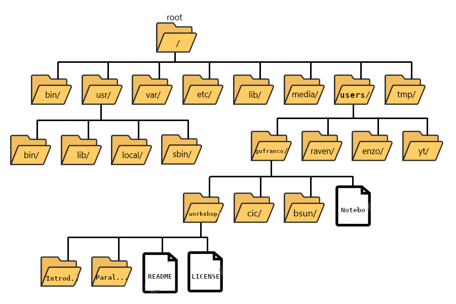

:::::::::::::::::::::::::::::::::::::: questions

- "How do I use the Linux terminal?"

::::::::::::::::::::::::::::::::::::::::::::::::

::::::::::::::::::::::::::::::::::::: objectives

- "Learn the most basic UNIX/Linux commands"
- "Learn how to navigate the filesystem"
- "Creating, moving, and removing files/directories"

::::::::::::::::::::::::::::::::::::::::::::::::

## Command Line Interface

At a high level, an HPC cluster is just a bunch of computers that appear to the user like a single entity to execute calculations. A machine where several users can work simultaneously.
The users expect to run a variety of scientific codes.
To do that, users store the data needed as input, and at the end of the calculations, the data generated as output is also stored or used to create plots and tables via postprocessing tools and scripts.
In HPC, compute nodes can communicate with each other very efficiently. For some calculations that are too demanding for a single computer, several computers could work together on a single calculation, eventually sharing information. 

Our daily interactions with regular computers like desktop computers and laptops occur via various devices, such as the keyboard and mouse, touch screen interfaces, or the microphone when using speech recognition systems. 
Today, we are very used to interact with computers graphically, tablets, and phones, the GUI is widely used to interact with them.
Everything takes place with graphics. You click on icons, touch buttons, or drag and resize photos with your fingers.


However, in HPC, we need an efficient and still very light way of communicating with the computer that acts as the front door of the cluster, the **login node**.
We use the **shell** instead of a **graphical user interface** (GUI) for interacting with the HPC cluster.


In the GUI, we give instructions using a keyboard, mouse, or touchscreen.
This way of interacting with a computer is intuitive and very easy to learn but scales very poorly for large streams of instructions, even if they are similar or identical.
All that is very convenient but that is now how we use HPC clusters.

Later on in this lesson, we will show how to use Open On-demand, a web service that allows you to run interactive executions on the cluster using a web interface and your browser.
For most of this lesson, we will use the Command Line Interface, and you need to familiarize yourself with it.

For example, you need to copy the third line of each of a thousand text files stored in a thousand different folders and paste it into a single file line by line. Using the traditional GUI approach of mouse clicks will take several hours to do this.

This is where we take advantage of the shell - a **command-line interface** (CLI) to make such repetitive tasks with less effort.
It can take a single instruction and repeat it as is or with some modification as many times as we want.
The task in the example above can be accomplished in a single line of a few instructions.

The heart of a command-line interface is a **read-evaluate-print loop** (REPL) so, called because when you type a command and press <kbd>Return</kbd> (also known as <kbd>Enter</kbd>), the shell
reads your command, evaluates (or "executes") it, prints the output of your command, loops back and waits for you to enter another command. The REPL is essential in how we interact with HPC clusters.

Even if you are using a GUI frontend such as *Jupyter* or *RStudio*, REPL is there for us to instruct computers on what to do next.

### The Shell


The Shell is a program that runs other programs rather than doing calculations itself.
Those programs can be as complicated as climate modeling software and as simple as a
program that creates a new directory. The simple programs which are used to perform
stand-alone tasks are usually referred to as commands.
The most popular Unix shell is Bash (the Bourne Again SHell --- so-called because
it's derived from a shell written by Stephen Bourne).
Bash is the default shell on most modern implementations of Unix and in most packages that provide Unix-like tools for Windows.


When the shell is first opened, you are presented with a **prompt**,
indicating that the shell is waiting for input.

```
~$
```

The shell we will use for this lessos will be shown as ``~$ ``. 
Notice that the prompt may be customized by the user to have more information such as date, user, host, current working directory and many other pieces of information. For example you can see my prompt as ``22:16:00-gufranco@trcis001:~$``.

::: callout

## The prompt

When typing commands from these lessons or other sources, *do not type the prompt*, only the commands that follow it.

```
~$ ls -al
```

:::

### Why use the Command Line Interface?

Before the usage of **Command Line Interface** (CLI), computer interaction took place with perforated cards or even switching cables on a big console. Despite all the years of new technology and innovation, the mouse, touchscreens and voice recognition; the CLI remains one of the most powerful and flexible tools for interacting with computers.

Because it is radically different from a GUI, the CLI can take some effort and time to learn. A GUI presents you with choices to click on. With a CLI, the choices are combinations of commands and parameters, more akin to words in a language than buttons on a screen. Because the options are not presented to you, some vocabulary is necessary in this new "language." But a small number of commands gets you a long way, and we'll cover those essential commands below.

### Flexibility and automation

The grammar of a shell allows you to combine existing tools into powerful
pipelines and handle large volumes of data automatically. Sequences of
commands can be written into a *script*, improving the reproducibility of
workflows and allowing you to repeat them easily.

In addition, the command line is often the easiest way to interact with remote machines and supercomputers.
Familiarity with the shell is essential to run a variety of specialized tools and resources
including high-performance computing systems.
As clusters and cloud computing systems become more popular for scientific data crunching,
being able to interact with the shell is becoming a necessary skill.
We can build on the command-line skills covered here
to tackle a wide range of scientific questions and computational challenges.


## Starting with the shell

If you still need to download the hands-on materials. This is the perfect opportunity to do so

```
~$ git clone https://github.com/WVUHPC/workshops_hands-on.git
```

Let's look at what is inside the `workshops_hands-on` folder and explore it further. First, instead of clicking on the folder name to open it and look at its contents, we have to change the folder we are in. When working with any programming tools, **folders are called directories**. We will be using folder and directory interchangeably moving forward.

To look inside the `workshops_hands-on` directory, we need to change which directory we are *in*. To do this, we can use the `cd` command, which stands for "change directory". 

```
~$ cd workshops_hands-on
```

Did you notice a change in your command prompt? The "~" symbol from before should have been replaced by the string `~/workshops_hands-on$ `. This means our `cd` command ran successfully, and we are now *in* the new directory. Let's see what is in here by listing the contents:

```bash
~$ ls
```

You should see:

```
Introduction_HPC  LICENSE  Parallel_Computing  README.md  Scientific_Programming  Spark
```

### Arguments

Six items are listed when you run `ls`, but what types of files are they, or are they directories or files? 

To get more information, we can modify the default behavior of `ls` with one or more **"arguments"**. 

```
~$ ls -F

Introduction_HPC/  LICENSE  Parallel_Computing/  README.md  Scientific_Programming/  Spark/
```

Anything with a "/" after its name is a directory. Things with an asterisk "*" after them are programs.  If there are no "decorations" after the name, it's a regular text file.

You can also use the argument `-l` to show the directory contents in a long-listing format that provides a lot more information:

```
~$ ls -l
```

```
total 64
drwxr-xr-x 13 gufranco its-rc-thorny  4096 Jul 23 22:50 Introduction_HPC
-rw-r--r--  1 gufranco its-rc-thorny 35149 Jul 23 22:50 LICENSE
drwxr-xr-x  6 gufranco its-rc-thorny  4096 Jul 23 22:50 Parallel_Computing
-rw-r--r--  1 gufranco its-rc-thorny   715 Jul 23 22:50 README.md
drwxr-xr-x  9 gufranco its-rc-thorny  4096 Jul 23 22:50 Scientific_Programming
drwxr-xr-x  2 gufranco its-rc-thorny  4096 Jul 23 22:50 Spark
```

Each line of output represents a file or a directory. The directory lines start with `d`. If you want to combine the two arguments `-l` and `-F`, you can do so by saying the following:

```
~$ ls -lF
```

Do you see the modification in the output?

::::::::::::::::::::::::::::::::::::::: discussion

### Details

Notice that the listed directories now have ``/`` at the end of their names.

:::::::::::::::::::::::::::::::::::::::::::::::::::

::: callout

**Tip** - **All commands are essentially programs** that are able to perform specific, commonly-used tasks.

Most commands will take additional arguments controlling their behavior, and some will take a file or directory name as input. How do we know what the available arguments that go with a particular command are? Most commonly used shell commands have a manual available in the shell. You can access the
manual using the `man` command. Let's try this command with `ls`:

```bash
$ man ls
```

This will open the manual page for `ls`, and you will lose the command prompt. It will bring you to a so-called "buffer" page, a page you can navigate with your mouse, or if you want to use your keyboard, we have listed some basic keystrokes:
* 'spacebar' to go forward 
* 'b' to go backward
* Up or down arrows to go forward or backward, respectively

**To get out of the `man` "buffer" page and to be able to type commands again on the command prompt, press the `q` key!**

:::

::::::::::::::::::::::::::::::::::::: challenge

## Exercise

* Open up the manual page for the `find` command. Skim through some of the information. 
    * Would you be able to learn this much information about many commands by heart? 
    * Do you think this format of information display is useful for you?
    
* Quit the `man` buffer (using the key `q`) and return to your command prompt.  

> **Tip** - Shell commands can get extremely complicated. No one can learn all of these arguments, of course. So you will likely refer to the manual page frequently.
>
> **Tip** - If the manual page within the Terminal is hard to read and traverse, the manual exists online, too. Use your web-searching powers to get it! In addition to the arguments, you can also find good examples online; ***Google is your friend.***

:::::::::::::::: solution

```
~$ man find
```

:::::::::::::::::::::::::
:::::::::::::::::::::::::::::::::::::::::::::::

## The Unix directory file structure (a.k.a. where am I?) 

Let's practice moving around a bit. Let's go into the `Introduction_HPC` directory and see what is there.

```bash
$ cd Introduction_HPC

$ ls -l
```

Great, we have traversed some sub-directories, but where are we in the context of our pre-designated "home" directory containing the `workshops_hands-on` directory?!

### The "root" directory!

Like on any computer you have used before, the file structure within a Unix/Linux system is hierarchical, like an upside-down tree with the "/" directory, called "root" as the starting point of this tree-like structure:

{alt="File Tree"}

> **Tip** - Yes, the root folder's actual name is just **`/`** (a forward slash).

That `/` or root is the 'top' level.

When you log in to a remote computer, you land on one of the branches of that tree, i.e., your pre-designated "home" directory that usually has your login name as its name (e.g. `/users/gufranco`).

> **Tip** - On macOS, which is a UNIX-based OS, the root level is also "/". 
>
> **Tip** - On a Windows OS, it is drive-specific; "C:\" is considered the default root, but it changes to "D:\", if you are on another drive.

### Paths

Now let's learn more about the "addresses" of directories, called **"path"**, and move around the file system.

Let's check to see what directory we are in. The command prompt tells us which directory we are in, but it doesn't give information about where the `Introduction_HPC` directory is with respect to our "home" directory or the `/` directory.

The command to check our current location is `pwd`. This command does not take any arguments, and it returns the path or address of your **p**resent **w**orking **d**irectory (the folder you are in currently).

```
~$ pwd
```

In the output here, each folder is separated from its "parent" or "child" folder by a "/", and the output starts with the root `/` directory. So, you are now able to determine the location of `Introduction_HPC` directory relative to the root directory!

But which is your pre-designated home folder? No matter where you have navigated to in the file system, just typing in `cd` will bring you to your home directory. 

```
~$ cd
```

What is your present working directory now?

```
~$ pwd
```

This should now display a shorter string of directories starting with root. This is the full address to your home directory, also referred to as "**full path**". **The "full" here refers to the fact that the path starts with the root, which means you know which branch of the tree you are on in reference to the root.**

Take a look at your command prompt now. Does it show you the name of this directory (your username?)? 

*No, it doesn't. Instead of the directory name, it shows you a `~`.*

Why is this so? 

*This is because `~` = full path to the home directory for the user.*

Can we just type `~` instead of `/users/username`?

*Yes, we can!*

#### Using paths with commands

You can do much more with the idea of stringing together *parent/child* directories. Let's say we want to look at the contents of the `Introduction_HPC` folder but do it from our current directory (the home directory. We can use the list command and follow it up with the path to the folder we want to list!

```
~$ cd

~$ ls -l ~/workshops_hands-on/Introduction_HPC
```

Now, what if we wanted to change directories from ``~`` (home) to ``Introduction_HPC`` in a single step?

```bash
~$ cd ~/workshops_hands-on/Introduction_HPC
```

Done! You have moved two levels of directories in one command.

What if we want to move back up and out of the ``Introduction_HPC`` directory? Can we just type `cd workshops_hands-on`? Try it and see what happens.

*Unfortunately, that won't work because when you say ``cd workshops_hands-on``, shell is looking for a folder called `workshops_hands-on` within your current directory, i.e. `Introduction_HPC`.*

Can you think of an alternative? 

*You can use the full path to workshops_hands-on!*

```bash
$ cd ~/workshops_hands-on
```

>**Tip**
>What if we want to navigate to the previous folder but can't quite remember the full or relative path, or want to get there quickly without typing a lot? In this case, we can use `cd -`. When `-` is used in this context it is referring to a special variable called `$OLDPWD` that is stored without our having to assign it anything. We'll learn more about variables in a future lesson, but for now you can see how this command works. Try typing:
>```bash
>cd -
>```
> This command will move you to the last folder you were in before your current location, then display where you now are! If you followed the steps up until this point it will have moved you to `~/workshops_hands-on/Introduction_HPC`. You can use this command again to get back to where you were before (`~/workshops_hands-on`) to move on to the Exercises.

****

**Exercises**

1. First, move to your home directory.
2. Then, list the contents of the `Parallel_Computing` directory within the `workshops_hands-on` directory.

****

#### Tab completion

Typing out full directory names can be time-consuming and error-prone. One way to avoid that is to use **tab completion**. The `tab` key is located on the left side of your keyboard, right above the `caps lock` key. When you start typing out the first few characters of a directory name, then hit the `tab` key, Shell will try to fill in the rest of the directory name. 

For example, first type `cd` to get back to your home directly, then type `cd uni`, followed by pressing the `tab` key:

```bash
$ cd
$ cd work<tab>
```

The shell will fill in the rest of the directory name for `workshops_hands-on`. 

Now, let's go into `Introduction_HPC`, then type `ls 1`, followed by pressing the `tab` key once:

```bash
$ cd Introduction_HPC/
$ ls 1<tab>
```

**Nothing happens!!**

The reason is that there are multiple files in the `Introduction_HPC` directory that start with `1`. As a result, shell needs to know which one to fill in. When you hit `tab` a second time again, the shell will then list all the possible choices.

```bash
$ ls 1<tab><tab>
```

Now you can select the one you are interested in listed, enter the number, and hit the tab again to fill in the complete name of the file.

```bash
$ ls 15._Shell<tab>
```

> **NOTE:** Tab completion can also fill in the names of commands. For example, enter `e<tab><tab>`. You will see the name of every command that starts with an `e`. One of those is `echo`. If you enter `ech<tab>`, you will see that tab completion works. 

**Tab completion is your friend!** It helps prevent spelling mistakes and speeds up the process of typing in the full command. We encourage you to use this when working on the command line. 

#### Relative paths

We have talked about **full** paths so far, but there is a way to specify paths to folders and files without having to worry about the root directory. You used this before when we were learning about the `cd` command.

Let's change directories back to our home directory and once more change directories from `~` (home) to `Introduction_HPC` in a single step. (*Feel free to use your tab-completion to complete your path!*)

```bash
$ cd
$ cd workshops_hands-on/Introduction_HPC
```

This time we are not using the `~/` before `workshops_hands-on`. In this case, we are using a relative path, relative to our current location - wherein we know that `workshops_hands-on` is a child folder in our home folder, and the `Introduction_HPC` folder is within `workshops_hands-on`.

> Previously, we had used the following:
> ```bash
> $ cd ~/workshops_hands-on/Introduction_HPC
> ```

There is also a handy shortcut for the relative path to a parent directory, two periods `..`. Let's say we wanted to move from the `Introduction_HPC` folder to its parent folder.

```bash
cd ..
```

You should now be in the `workshops_hands-on` directory (check the command prompt or run `pwd`).

> You will learn more about the `..` shortcut later. Can you think of an example when this shortcut to the parent directory won't work?
>
>   <details>
>     <summary>Answer</summary>
>     <P>When you are at the root directory, since there is no parent to the root directory!</P>
>   </details>

When using relative paths, you might need to check what the branches are downstream of the folder you are in. There is a really handy command (`tree`) that can help you see the structure of any directory.

```bash
$ tree
```

If you are aware of the directory structure, you can string together a list of directories as long as you like using either **relative** or **full** paths.

#### Synopsis of Full versus Relative paths

**A full path always starts with a `/`, a relative path does not.**

A relative path is like getting directions from someone on the street. They tell you to "go right at the Stop sign, and then turn left on Main Street". That works great if you're standing there together, but not so well if you're trying to tell someone how to get there from another country. A full path is like GPS coordinates. It tells you exactly where something is, no matter where you are right now.

You can usually use either a full path or a relative path depending on what is most convenient. If we are in the home directory, it is more convenient to just enter the relative path since it involves less typing.

Over time, it will become easier for you to keep a mental note of the structure of the directories that you are using and how to quickly navigate among them.


## Copying, creating, moving, and removing data

Now we can move around within the directory structure using the command line. But what if we want to do things like copy files or move them from one directory to another, rename them? 

Let's move into the `Introduction_HPC` directory, which contains some more folders and files: 

```bash
cd ~/workshops_hands-on/Introduction_HPC
cd 2._Command_Line_Interface
```

### Copying

Let's use the copy (`cp`) command to make a copy of one of the files in this folder, `Mov10_oe_1.subset.fq`, and call the copied file `Mov10_oe_1.subset-copy.fq`. 
The copy command has the following syntax: 

`cp  path/to/item-being-copied  path/to/new-copied-item`

In this case the files are in our current directory, so we just have to specify the name of the file being copied, followed by whatever we want to call the newly copied file.

```bash
$ cp OUTCAR OUTCAR_BKP

$ ls -l
```

The copy command can also be used for copying over whole directories, but the `-r` argument has to be added after the `cp` command. The `-r` stands for "recursively copy everything from the directory and its sub-directories". 

We used it earlier when we copied over the `workshops_hands-on` directory to our home directories #copying-example-data-folder).

### Creating

Next, let's create a directory called `ABINIT` and we can move the copy of the input files into that directory. 

The `mkdir` command is used to make a directory, syntax: `mkdir name-of-folder-to-be-created`.

```bash
$ mkdir ABINIT
```

> **Tip** - File/directory/program names with spaces in them do not work well in Unix. Use characters like hyphens or underscores instead. Using underscores instead of spaces is called "snake_case". Alternatively, some people choose to skip spaces and rather just capitalize the first letter of each new word (i.e. MyNewFile). This alternative technique is called "CamelCase".

### Moving

We can now move our copied input files into the new directory. We can move files around using the move command, `mv`, syntax: 

`mv  path/to/item-being-moved  path/to/destination` 

In this case, we can use relative paths and just type the name of the file and folder.

```bash
$ mv 14si.pspnc INCAR t17.files t17.in ABINIT/
```

Let's check if the move command worked like we wanted:

```bash
$ ls -l ABINIT
```


Let us run abinit, this is a quick execution, and you have not yet learned how to submit jobs. So, for this exceptional time, we will execute this on the 
login node

```bash
cd ABINIT
$ module load atomistic/abinit/9.8.4_intel22_impi22 
$ mpirun -np 4 abinit < t17.files 
```

### Renaming

The `mv` command has a second functionality, it is what you would use to rename files, too. The syntax is identical to when we used `mv` for moving, but this time instead of giving a directory as its destination, we just give a new name as its destination. 


The files t17.out can be renamed, the ABINIT could run again with some change in the input. We want to rename that file:

```bash
$ mv t17.out t17.backup.out

$ ls
```

> **Tip** - You can use `mv` to move a file and rename it simultaneously!

**Important notes about `mv`**:
* When using `mv`, the shell will **not** ask if you are sure that you want to "replace existing file" or similar unless you use the -i option. 
* Once replaced, it is not possible to get the replaced file back!


### Removing

We did not need to create a backup of our output as we noticed this file is no longer needed; in the interest of saving space on the cluster, we want to delete the contents of the `t17.backup.out`. 

```bash
$ rm t17.backup.out
```

Important notes about `rm`
* `rm` permanently removes/deletes the file/folder. 
* There is no concept of "Trash" or "Recycle Bin" on the command line. When you use `rm` to remove/delete, they're really gone. 
* **Be careful with this command!**
* You can use the `-i` argument if you want it to ask before removing `rm -i file-name`.

Let's delete the ABINIT folder too. First, we'll have to navigate our way to the parent directory (we can't delete the folder we are currently in/using). 

```bash
$ cd ..

$ rm  ABINIT
```

Did that work? Did you get an error?

<details>
  <summary><i>Explanation</i></summary>
  <P>By default, <code>rm</code>, will NOT delete directories, but you use the <code>-r</code> flag if you are sure that you want to delete the directories and everything within them. To be safe, let's use it with the <code>-i</code> flag.</P>
</details><br>

```bash
$ rm -ri ABINIT
```

- `-r`: recursive, commonly used as an option when working with directories, e.g. with `cp`. 
- `-i`: prompt before every removal.

***

**Exercise**

1. Create a new folder in `workshops_hands-on` called `abinit_test`
2. Copy over the abinit inputs from `2._Command_Line_Interface` to the `~/workshops_hands-on/Introduction_HPC/2._Command_Line_Interface/abinit_test` folder
3. Rename the `abinit_test` folder and call it `exercise1`

***

## Exiting from the cluster

To close the interactive session on the cluster and disconnect from the cluster, the command is `exit`. So, you are going to have to run the exit command twice.

```
00:11:05-gufranco@trcis001:~$ exit
logout
Connection to trcis001 closed.
guilleaf@MacBook-Pro-15in-2015 ~ %
```

## 10 Unix/Linux commands to learn and use


The `echo` and `cat` commands
-----------------------------

The `echo` command is very basic; it returns what you give back to the terminal, kinda like an echo. Execute the command below.

```
$ echo "I am learning UNIX Commands"
```

```
I am learning UNIX Commands
```
{: .output}

This may not seem that useful right now. However, `echo` will also print the
contents of a variable to the terminal. There are some default variables set for
each user on the HPCs: `$HOME` is the pathway to the user's "home" directory,
and `$SCRATCH` is Similarly the pathway to the user's "scratch" directory. More
info on what those directories are for later, but for now, we can print them to
the terminal using the `echo` command.

```
$ echo $HOME
```

```
/users/<username>
```
{: .output}
```
$ echo $SCRATCH
```

```
/scratch/<username>
```
{: .output}


In addition, the shell can do basic arithmetical operations, execute
this command:

```
$ echo $((23+45*2))
```

```
113
```
{: .output}

Notice that, as customary in mathematics, products take precedence over
addition. That is called the PEMDAS order of operations, ie
\"Parentheses, Exponents, Multiplication and Division, and Addition and
Subtraction\". Check your understanding of the PEMDAS rule with this
command:

```
$ echo $(((1+2**3*(4+5)-7)/2+9))
```

```
42
```
{: .output}

Notice that the exponential operation is expressed with the `**`
operator. The usage of `echo` is important. Otherwise, if you execute
the command without `echo`, the shell will do the operation and will try
to execute a command called `42` that does not exist on the system. Try
by yourself:

```
$ $(((1+2**3*(4+5)-7)/2+9))
```

```
-bash: 42: command not found
```
{: .output}

As you have seen before, when you execute a command on the terminal, in
most cases you see the output printed on the screen. The next thing to
learn is how to redirect the output of a command into a file. It will
be very important to submit jobs later and control where and how the
output is produced. Execute the following command:

```
$ echo "I am learning UNIX Commands." > report.log
```


With the character `>` redirects the output from `echo` into a file
called *report.log*. No output is printed on the screen. If the file
does not exist, it will be created. If the file existed previously, it was erased, and only the new contents were stored. In fact, `>` can be used
to redirect the output of any command to a file!

To check that the file actually contains the line produced by `echo`,
execute:

```
$ cat report.log
```

```
I am learning UNIX Commands.
```
{: .output}

The cat (concatenate) command displays the contents of one or several
files. In the case of multiple files, the files are printed in the order
they are described in the command line, concatenating the output as per the
name of the command.

<!-- **Seems unnecessary**
You can even use a nice trick to write a small text on a file. Execute
the following command, followed by the text that you want to write, at
the end execute `Ctrl-D` (`^D`), the *Control Key* followed by the `D`
key. I am annotating below the location where `^D` should be executed:

```
$ cat > report.log
I am learning UNIX Commands^D
$ cat report.log
I am learning UNIX Commands
```

-->

In fact, there are hundreds of commands, most of them with a variety of
options that change the behavior of the original command. You can feel
bewildered at first by a large number of existing commands, but 
most of the time, you will be using a very small number of them.
Learning those will speed up your learning curve.


Folder commands
---------------

As mentioned, UNIX organizes data in storage devices as a
tree. The commands `pwd`, `cd` and `mkdir` will allow you to know where
you are, move your location on the tree, and create new folders. Later, we
will learn how to move folders from one location on the tree to another.

The first command is `pwd`. Just execute the command on the terminal:

```
$ pwd
```

```
/users/<username>
```
{: .output}

It is always very important to know where in the tree you are.
Doing research usually involves dealing with a large amount of
data, and exploring several parameters or physical conditions. Therefore, organizing
the filesystem is key.


When you log into a cluster, by default, you are located on your `$HOME`
folder. That is why the `pwd` command should return that
location in the first instance.

The following command `cd` is used to *change the directory*.
A directory is another name for *folder* and is
widely used; in UNIX, the terms are
interchangeable. Other Desktop Operating Systems like Windows and MacOS
have the concept of *smart folders* or *virtual folders*, where the
*folder* that you see on screen has no correlation with a directory in
the filesystem. In those cases, the distinction is relevant.

There is another important folder defined in our clusters, it's called
the scratch folder, and each user has its own. The location of the folder
is stored in the variable `$SCRATCH`. Notice that this is internal
convection and is not observed in other HPC clusters.

Use the next command to go to that folder:

```
$ cd $SCRATCH
$ pwd
```

```
/scratch/<username>
```
{: .output}

Notice that the location is different now; if you are using this account
for the first time, you will not have files on this folder. It is time to
learn another command to list the contents of a *folder*, execute:

```
$ ls
```


Assuming that you are using your HPC account for the first time, you
will not have anything in your `$SCRATCH` folder and should therefore see no
output from `ls`. This is a good opportunity to start your filesystem by creating one folder
and moving into it, execute:

```
$ mkdir test_folder
$ cd test_folder
```


`mkdir` allows you to create folders
in places where you are authorized to do so, such as your `$HOME`
and `$SCRATCH` folders. Try this command:

```
$ mkdir /test_folder
```

```
mkdir: cannot create directory `/test_folder': Permission denied
```
{: .output}

There is an important difference between `test_folder` and
`/test_folder`. The former is a location in your current
directory, and the latter is a location starting on the root directory
`/`. A normal user has no rights to create folders on that directory so
`mkdir` will fail, and an error message will be shown on your screen.

Notice that we named it `test_folder` instead of `test folder`. In UNIX, there is no restriction regarding files or
directories with spaces, but using them can become a nuisance on the command
line. If you want to create the folder with spaces from the command
line, here are the options:

```
$ mkdir "test folder with spaces"
$ mkdir another\ test\ folder\ with\ spaces
```


In any case, you have to type extra characters to prevent the command
line application from considering those spaces as separators for several
arguments in your command. Try executing the following:

```
$ mkdir another folder with spaces
$ ls
```

```
another folder with spaces  folder  spaces  test_folder  test folder with spaces  with
```
{: .output}

Maybe is not clear what is happening here. There is an option for `ls`
that present the contents of a directory:

```
$ ls -l
```

```
total 0
drwxr-xr-x 2 myname mygroup 512 Nov  2 15:44 another
drwxr-xr-x 2 myname mygroup 512 Nov  2 15:45 another folder with spaces
drwxr-xr-x 2 myname mygroup 512 Nov  2 15:44 folder
drwxr-xr-x 2 myname mygroup 512 Nov  2 15:44 spaces
drwxr-xr-x 2 myname mygroup 512 Nov  2 15:45 test_folder
drwxr-xr-x 2 myname mygroup 512 Nov  2 15:45 test folder with spaces
drwxr-xr-x 2 myname mygroup 512 Nov  2 15:44 with
```
{: .output}

It should be clear, now what happens when the spaces are not contained
in quotes `"test folder with spaces"` or escaped as
`another\ folder\ with\ spaces`. This is the perfect opportunity to
learn how to delete empty folders. Execute:

```
$ rmdir another
$ rmdir folder spaces with
```


You can delete one or several folders, but all those folders must be
empty. If those folders contain files or more folders, the command will
fail and an error message will be displayed.

After deleting those folders created by mistake, let\'s check the
contents of the current directory. The command `ls -1` will list the
contents of a file one per line, something very convenient for future
scripting:

```
$ ls -1
```

```
total 0
drwxr-xr-x 2 myname mygroup 512 Nov  2 15:45 another folder with spaces
drwxr-xr-x 2 myname mygroup 512 Nov  2 15:45 test_folder
drwxr-xr-x 2 myname mygroup 512 Nov  2 15:45 test folder with spaces
```
{: .output}

Commands for copy and move
--------------------------

The next two commands are `cp` and `mv`. They are used to copy or move
files or folders from one location to another. In its simplest usage,
those two commands take two arguments: the first argument is the source
and the last one is the destination. In the case of more than two
arguments, the destination must be a directory. The effect will be to
copy or move all the source items into the folder indicated as the
destination.

Before doing a few examples with `cp` and `mv`, let\'s use a very handy
command to create files. The command `touch` is used to update the
access and modification times of a file or folder to the current time.
If there is no such file, the command will create a new empty
file. We will use that feature to create some empty files for the
purpose of demonstrating how to use `cp` and `mv`.

Let's create a few files and directories:

```
$ mkdir even odd
$ touch f01 f02 f03 f05 f07 f11
```


Now, lets copy some of those existing files to complete all the numbers
up to `f11`:

```
$ cp f03 f04
$ cp f05 f06
$ cp f07 f08
$ cp f07 f09
$ cp f07 f10
```


This is a good opportunity to present the `*` *wildcard*, and use it to
replace an arbitrary sequence of characters. For instance, execute this
command to list all the files created above:

```
$ ls f*
```

```
f01  f02  f03  f04  f05  f06  f07  f08  f09  f10  f11
```
{: .output}

The *wildcard* is able to replace zero or more arbitrary characters, for example:

```
$ ls f*1
```

```
f01  f11
```
{: .output}

There is another way of representing files or directories that follow a
pattern, execute this command:

```
$ ls f0[3,5,7]
```

```
f03  f05  f07
```
{: .output}

The files selected are those whose last character is on the list
`[3,5,7]`. Similarly, a range of characters can be represented. See:

```
$ ls f0[3-7]
```

```
f03  f04  f05  f06  f07
```
{: .output}

We will use those special characters to move files based on their parity.
Execute:

```
$ mv f[0,1][1,3,5,7,9] odd
$ mv f[0,1][0,2,4,6,8] even
```


The command above is equivalent to executing the explicit listing of
sources:

```
$ mv f01 f03 f05 f07 f09 f11 odd
$ mv f02 f04 f06 f08 f10 even
```


Delete files and Folders
------------------------

As we mentioned above, empty folders can be deleted with the command
`rmdir`, but that only works if there are no subfolders or files inside
the folder that you want to delete. See for example, what happens if you
try to delete the folder called `odd`:

```
$ rmdir odd
```

```
rmdir: failed to remove `odd': Directory not empty
```

If you want to delete odd, you can do it in two ways. The command
`rm` allows you to delete one or more files entered as arguments. Let\'s
delete all the files inside odd, followed by the deletion of the folder
`odd` itself:

```
~$ rm odd/*
~$ rmdir odd
```

Another option is to delete a folder recursively, this is a powerful but
also dangerous option. Quite unlike Windows/MacOS, recovering deleted files
through a "Trash Can" or "Recycling Bin" does not happen in Linux; deleting
is permanent. Let\'s delete the folder even recursively:

```
~$ rm -r even
```

Summary of Basic Commands
-------------------------

The purpose of this brief tutorial is to familiarize you with the most common commands used in UNIX environments. We have shown ten commands
that you will be using very often in your interaction. These 10 basic commands and one editor from the next section are all that you need to be ready to submit jobs on the cluster.

The next table summarizes those commands.


| Command | Description       | Examples                     |
|---------|:------------------|:-----------------------------|
| `echo`  | Display a given message on the screen | `$ echo "This is a message"` |
|---------|-------------------|------------------------------|
| `cat`   | Display the contents of a file on screen <br> Concatenate files | `$ cat my_file` |
|---------|-------------------|------------------------------|
| `date`  | Shows the current date on screen | `$ date` <br> Sun Jul 26 15:41:03 EDT 2020 |
|---------|-------------------|------------------------------|
| `pwd`   | Return the path to the current working directory | `$ pwd` <br> /users/username                  |
|---------|-------------------|------------------------------|
| `cd`    | Change directory  | `$ cd sub_folder`           |
|---------|-------------------|------------------------------|
| `mkdir` | Create directory  | `$ mkdir new_folder`        |
|---------|-------------------|------------------------------|
| `touch` | Change the access and modification time of a file <br> Create empty files     | `$ touch new_file` |
|---------|-------------------|------------------------------|
| `cp`    | Copy a file in another location <br> Copy several files into a destination directory  | `$ cp old_file new_file`  |
|---------|-------------------|------------------------------|
| `mv`    | Move a file in another location <br> Move several files into a destination folder | `$ mv old_name new_name`  |
|---------|-------------------|------------------------------|
| `rm`    | Remove one or more files from the file system tree | `$ rm trash_file` <br> `$ rm -r full_folder`         |
|---------|-------------------|------------------------------|

> ## Exercise 1
>
> Get into Thorny Flat with your training account and execute the commands `ls`, `date`, and `cal`
>
> Exit from the cluster with `exit`
>
>
> So let's try our first command, which will list the contents of the current directory:
>
> ~~~
> [training001@srih0001 ~]$ ls -al
> ~~~
> 
> ~~~
> total 64
> drwx------   4 training001 training   512 Jun 27 13:24 .
> drwxr-xr-x 151 root        root     32768 Jun 27 13:18 ..
> -rw-r--r--   1 training001 training    18 Feb 15  2017 .bash_logout
> -rw-r--r--   1 training001 training   176 Feb 15  2017 .bash_profile
> -rw-r--r--   1 training001 training   124 Feb 15  2017 .bashrc
> -rw-r--r--   1 training001 training   171 Jan 22  2018 .kshrc
> drwxr-xr-x   4 training001 training   512 Apr 15  2014 .mozilla
> drwx------   2 training001 training   512 Jun 27 13:24 .ssh
> ~~~
> {: .output}
>
> > ## Command not found
> > If the shell can't find a program whose name is the command you typed, it
> > will print an error message such as:
> >
> > ~~~
> > $ ks
> > ~~~
> > 
> > ~~~
> > ks: command not found
> > ~~~
> > {: .output}
> >
> > Usually this means that you have mis-typed the command.
> {: .callout}
>
{: .challenge}

> ## Exercise 2
>
> Commands in Unix/Linux are very stable with some existing for decades now. This exercise begins to give you a feeling of the different parts of a command.
>
> Execute the command `cal`, we executed the command before  but this time execute it again like this `cal -y`. You should get an output like this:
>
> ~~~
> [training001@srih0001 ~]$ cal -y
> ~~~
> 
> ~~~
>                          2021
>
> January               February                 March
> Su Mo Tu We Th Fr Sa   Su Mo Tu We Th Fr Sa   Su Mo Tu We Th Fr Sa
> 1  2       1  2  3  4  5  6       1  2  3  4  5  6
> 3  4  5  6  7  8  9    7  8  9 10 11 12 13    7  8  9 10 11 12 13
> 10 11 12 13 14 15 16   14 15 16 17 18 19 20   14 15 16 17 18 19 20
> 17 18 19 20 21 22 23   21 22 23 24 25 26 27   21 22 23 24 25 26 27
> 24 25 26 27 28 29 30   28                     28 29 30 31
> 31
> April                   May                   June
> Su Mo Tu We Th Fr Sa   Su Mo Tu We Th Fr Sa   Su Mo Tu We Th Fr Sa
> 1  2  3                      1          1  2  3  4  5
> 4  5  6  7  8  9 10    2  3  4  5  6  7  8    6  7  8  9 10 11 12
> 11 12 13 14 15 16 17    9 10 11 12 13 14 15   13 14 15 16 17 18 19
> 18 19 20 21 22 23 24   16 17 18 19 20 21 22   20 21 22 23 24 25 26
> 25 26 27 28 29 30      23 24 25 26 27 28 29   27 28 29 30
> 30 31
> July                  August                September
> Su Mo Tu We Th Fr Sa   Su Mo Tu We Th Fr Sa   Su Mo Tu We Th Fr Sa
> 1  2  3    1  2  3  4  5  6  7             1  2  3  4
> 4  5  6  7  8  9 10    8  9 10 11 12 13 14    5  6  7  8  9 10 11
> 11 12 13 14 15 16 17   15 16 17 18 19 20 21   12 13 14 15 16 17 18
> 18 19 20 21 22 23 24   22 23 24 25 26 27 28   19 20 21 22 23 24 25
> 25 26 27 28 29 30 31   29 30 31               26 27 28 29 30
>
> October               November               December
> Su Mo Tu We Th Fr Sa   Su Mo Tu We Th Fr Sa   Su Mo Tu We Th Fr Sa
> 1  2       1  2  3  4  5  6             1  2  3  4
> 3  4  5  6  7  8  9    7  8  9 10 11 12 13    5  6  7  8  9 10 11
> 10 11 12 13 14 15 16   14 15 16 17 18 19 20   12 13 14 15 16 17 18
> 17 18 19 20 21 22 23   21 22 23 24 25 26 27   19 20 21 22 23 24 25
> 24 25 26 27 28 29 30   28 29 30               26 27 28 29 30 31
> 31
> ~~~
> {: .output}
>
> Another very simple command that is very useful in HPC is `date`.
> Without any arguments, it prints the current date to the screen.
>
> ~~~
> $ date
> ~~~
> 
> ~~~
> Sun Jul 26 15:41:03 EDT 2020
> ~~~
> {: .output}
{: .challenge}

> ## Exercise 3
>
> Create two folders called `one` and `two`.
> In `one` create the empty file `none1` and in `two` create > the empty file `none2`.
>
> Create also in those two folders, files `date1` and > `date2` by redirecting the output from the command `date` > using `>`.
> ~~~
> $ date > date1
> ~~~
> 
>
> Check with `cat` that those files contain dates.
>
> Now, create the folders `empty_files` and `dates` and move > the corresponding files `none1` and `none2` to > `empty_files` and do the same for `date1` and `date2`.
>
> The folders `one` and `two` should be empty now; delete > them with `rmdir`
> Do the same with folders `empty_files` and `dates` with `rm -r`.
>
{: .challenge}

> ## Exercise 4
>
> The command line is powerful enough even to do programming.
>Execute the command below and see the answer.
>
> ~~~
> [training001@srih0001 ~]$ n=1; while test $n -lt 10000; do  echo $n; n=`expr 2 \* $n`; done
> ~~~
> 
> ~~~
> 1
> 2
> 4
> 8
> 16
> 32
> 64
> 128
> 256
> 512
> 1024
> 2048
> 4096
> 8192
> ~~~
> {: .output}
>
>If you are not getting this output check the command line very carefully. Even small changes could be interpreted by the shell as entirely different commands so you need to be extra careful and gather insight when commands are not doing what you want.
>
> Now the challenge consists on tweaking the command line above to show the calendar for August for the next 10 years.
>
> > ## Hint
> >
> > Use the command ``cal -h`` to get a summary of the arguments to show just one month for one specific year
> > You can use ``expr`` to increase ``n`` by one on each cycle, but you can also use ``n=$(n+1)``
> >
{: .challenge}


## Grabbing files from the internet

To download files from the internet,
the absolute best tool is `wget`.
The syntax is relatively straightforwards: `wget https://some/link/to/a/file.tar.gz`

> ## Downloading the Drosophila genome
> The *Drosophila melanogaster* reference genome is located at the following website:
> [https://metazoa.ensembl.org/Drosophila_melanogaster/Info/Index](https://metazoa.ensembl.org/Drosophila_melanogaster/Info/Index).
> Download it to the cluster with `wget`.
>
> * `cd` to your genome directory
> * Copy this URL and paste it onto the command line:
>
>
>       $> wget ftp://ftp.ensemblgenomes.org:21/pub/metazoa/release-51/fasta/drosophila_melanogaster/dna/Drosophila_melanogaster.BDGP6.32.dna_rm.toplevel.fa.gz
>
{: .challenge}

> ## Working with compressed files, using unzip and gunzip
>
> The file we just downloaded is gzipped (has the `.gz`
> extension).
>You can uncompress it with `gunzip filename.gz`.
>
>File decompression reference:
>
>* **.tar.gz** - `tar -xzvf archive-name.tar.gz`
>* **.tar.bz2** - `tar -xjvf archive-name.tar.bz2`
>* **.zip** - `unzip archive-name.zip`
>* **.rar** - `unrar archive-name.rar`
>* **.7z** - `7z x archive-name.7z`
>
>However, sometimes we will want to compress files
>ourselves to make file transfers easier.
>The larger the file, the longer it will take to
>transfer.
>Moreover, we can compress a whole bunch of little
>files into one big file to make it easier
>on us (no one likes transferring 70000) little files!
>
>The two compression commands we'll probably want to
>remember are the following:
>
>* Compress a single file with Gzip - `gzip filename`
>* Compress a lot of files/folders with Gzip - `tar -czvf archive-name.tar.gz folder1 file2 folder3 etc`
>
{: .callout}

## Wildcards, shortcuts, and other time-saving tricks 

### Wild cards

**The "\*" wildcard:**

Navigate to the `~/workshops_hands-on/Introduction_HPC/2._Command_Line_Interface/ABINIT` directory. 

The "*" character is a shortcut for "everything". Thus, if you enter `ls *`, you will see all of the contents of a given directory. Now try this command:

```bash
$ ls 2*
```

This lists every file that starts with a `2`. Try this command:

```bash
$ ls /usr/bin/*.sh
```

This lists every file in `/usr/bin` directory that ends in the characters `.sh`. "*" can be placed anywhere in your pattern. For example:

```bash
$ ls t17*.nc
```

This lists only the files that begin with 't17' and end with `.nc`.

So, how does this actually work? The Shell (bash) considers an asterisk "*" to be a wildcard character that can match one or more occurrences of any character, including no character. 

> **Tip** - An asterisk/star is only one of the many wildcards in Unix, but this is the most powerful one, and we will be using this one the most for our exercises.

**The "?" wildcard:**

Another wildcard that is sometimes helpful is `?`. `?` is similar to `*` except that it is a placeholder for exactly one position. Recall that `*` can represent any number of following positions, including no positions. To highlight this distinction, lets look at a few examples. First, try this command:

```bash
$ ls /bin/d*
```

This will display all files in `/bin/` that start with "d" regardless of length. However, if you only wanted the things in `/bin/` that starts with "d" and are two characters long, then you can use:

```bash
$ ls /bin/d?
```

Lastly, you can chain together multiple "?" marks to help specify a length. In the example below, you would be looking for all things in `/bin/` that start with a "d" and have a name length of three characters.  

```bash
$ ls /bin/d??
``` 

****

**Exercise**

Do each of the following using a single `ls` command without
navigating to a different directory.

1.  List all of the files in `/bin` that start with the letter 'c'
2.  List all of the files in `/bin` that contain the letter 'a'
3.  List all of the files in `/bin` that end with the letter 'o'

BONUS: Using one command to list all of the files in `/bin` that contain either 'a' or 'c'. (Hint: you might need to use a different wildcard here. Refer to this [post](https://www.putorius.net/standard-wildcards-globbing-patterns-in.html) for some ideas.)

****


### Shortcuts

There are some very useful shortcuts that you should also know about. 

#### Home directory or "~"

Dealing with the home directory is very common. In the shell, the tilde character "~", is a shortcut for your home directory. Let's first navigate to the `ABINIT` directory (try to use tab completion here!):

```bash
$ cd
$ cd ~/workshops_hands-on/Introduction_HPC/2._Command_Line_Interface
```

Then enter the command:

```bash
$ ls ~
```

This prints the contents of your home directory without you having to type the full path. This is because the tilde "~" is equivalent to "/home/username", as we had mentioned in the previous lesson.

#### Parent directory or ".."

Another shortcut you encountered in the previous lesson is "..":

```bash
$ ls ..
```

The shortcut `..` always refers to the parent directory of whatever directory you are currently in. So, `ls ..` will print the contents of `unix_lesson`. You can also chain these `..` together, separated by `/`:

```bash
$ ls ../..
```

This prints the contents of `/n/homexx/username`, which is two levels above your current directory (your home directory). 

#### Current directory or "."

Finally, the special directory `.` always refers to your current directory. So, `ls` and `ls .` will do the same thing - they print the contents of the current directory. This may seem like a useless shortcut, but recall that we used it earlier when we copied over the data to our home directory.

To summarize, the commands `ls ~` and `ls ~/.` do exactly the same thing. These shortcuts can be convenient when you navigate through directories!

#### Command History

You can easily access previous commands by hitting the <button>up</button> arrow key on your keyboard. This way, you can step backward through your command history. On the other hand, the <button>down</button> arrow key takes you forward in the command history.

***Try it out! While on the command prompt, hit the <button>up</button> arrow a few times, and then hit the <button>down</button> arrow a few times until you are back to where you started.***

You can also review your recent commands with the `history` command. Just enter:

```bash
$ history
```

You should see a numbered list of commands, including the `history` command you just ran! 

Only a certain number of commands can be stored and displayed with the `history` command by default, but you can increase or decrease it to a different number. It is outside the scope of this workshop, but feel free to look it up after class.

> **NOTE:** So far, we have only run very short commands that have very few or no arguments. It would be faster to just retype it than to check the history. However, as you start to run analyses on the command line, you will find that the commands are longer and more complex, and the `history` command will be very useful!

#### Cancel a command or task

Sometimes as you enter a command, you realize that you don't want to continue or run the current line. Instead of deleting everything you have entered (which could be very long), you could quickly cancel the current line and start a fresh prompt with <kbd>Ctrl</kbd> + <kbd>C</kbd>.

```bash
$ # Run some random words, then hit "Ctrl + C". Observe what happens
```

Another useful case for <kbd>Ctrl</kbd> + <kbd>C</kbd> is when a task is running that you would like to stop. In order to illustrate this, we will briefly introduce the `sleep` command. `sleep N` pauses your command line from additional entries for N seconds. If we would like to have the command line not accept entries for 20 seconds, we could use:

```bash
$ sleep 20
```

While your `sleep` command is running, you may decide that in fact, you do want to have your command line back. To terminate the rest of the `sleep` command simply type:

<kbd>Ctrl</kbd> + <kbd>C</kbd>

This should terminate the rest of the `sleep` command. While this use may seem a bit silly, you will likely encounter many scenarios when you accidentally start running a task that you didn't mean to start, and <kbd>Ctrl</kbd> + <kbd>C</kbd> can be immensely helpful in stopping it.

**Other handy command-related shortcuts**

- <kbd>Ctrl</kbd> + <kbd>A</kbd> will bring you to the start of the command you are writing.
- <kbd>Ctrl</kbd> + <kbd>E</kbd> will bring you to the end of the command.

****

**Exercise**

1.  Checking the `history` command output, how many commands have you typed in so far?
2.  Use the <button>up</button> arrow key to check the command you typed before the `history` command. What is it? Does it make sense?
3.  Type several random characters on the command prompt. Can you bring the cursor to the start with <button>Ctrl</button> + <button>A</button>? Next, can you bring the cursor to the end with <button>Ctrl</button> + <button>E</button>? Finally, what happens when you use <button>Ctrl</button> + <button>C</button>?

****

## Summary: Commands, options, and keystrokes covered

```
~           # home dir
.           # current dir
..          # parent dir
*           # wildcard
ctrl + c    # cancel current command
ctrl + a    # start of line
ctrl + e    # end of line
history
```

---


## Advanced Bash Commands and Utilities

As you begin working more with the Shell, you will discover that there are mountains of different utilities at your fingertips to help increase command-line productivity. So far, we have introduced you to some of the basics to help you get started. In this lesson, we will touch on more advanced topics that can be very useful as you conduct analyses in a cluster environment. 

***

## Configuring your shell <a name="config"></a>

In your home directory, there are two hidden files, `.bashrc` and `.bash_profile`. These files contain all the startup configuration and preferences for your command line interface and are loaded before your Terminal loads the shell environment. Modifying these files allows you to change your preferences for features like your command prompt, the colors of text, and add aliases for commands you use all the time. 

> **NOTE:** These files begin with a dot (`.`) which makes it a hidden file. To view all hidden files in your home directory, you can use:
> 
> `$ ls -al ~/`

### `.bashrc` versus `.bash_profile` <a name="bashrc"></a>

You can put configurations in either file, and you can create either if it doesnt exist. **But why two different files? What is the difference?**

The difference is that **`.bash_profile` is executed for login shells, while `.bashrc` is executed for interactive non-login shells**. It is helpful to have these separate files when there are preferences you only want to see on the login and not every time you open a new terminal window. For example, suppose you would like to print some lengthy diagnostic information about your machine (load average, memory usage, current users, etc) - the `.bash_profile` would be a good place since you would only want in displayed once when starting out.   

Most of the time you dont want to maintain two separate configuration files for login and non-login shells. For example, when you export a `$PATH` (as we had done previously), you want it to apply to both. You can do this by sourcing `.bashrc` from within your `.bash_profile` file. Take a look at your `.bash_profile` file, it has already been done for you:

```bash
$ less ~/.bash_profile
```

You should see the following lines:

```bash
if [ -f ~/.bashrc ]; then
   source ~/.bashrc
fi
```

What this means is that if a `.bashrc` files exist, all configuration settings will be sourced upon logging in. Any settings you would like applied to all shell windows (login and interactive) can simply be added directly to the `.bashrc` file rather than in two separate files.

### Changing the prompt 

In your file `.bash_profile`, you can change your prompt by adding this:

```bash
PS1="\[\033[35m\]\t\[\033[m\]-\[\033[36m\]\u\[\033[m\]@$HOST_COLOR\h:\[\033[33;1m\]\w\[\033[m\]\$ "
export PS1
```

You have yet to learn how to edit text files. Keep in mind that when you know how to edit files, you can test this trick.
After editing the file, you need to source it or restart your terminal.

```bash
source ~/.bash_profile
```

### Aliases <a name="alias"></a>

An alias is a short name that the shell translates into another (usually longer) name or command. They are typically placed in the `.bash_profile` or `.bashrc` startup files so that they are available to all subshells. You can use the `alias` built-in command without any arguments, and the **shell will display a list of all defined aliases**:

```bash
$ alias
```

This should return to you the list of aliases that have been set for you, and you can see **the syntax used for setting an alias is**:

```bash
alias aliasname=value
```

When setting an alias **no spaces are permitted around the equal sign**. If value contains spaces or tabs, you must enclose the value within quotation marks. `ll` is a common alias that people use, and it is a good example of this:

```bash
alias ll='ls -l'
```

Since we have a modifier `-l` and there is a space required, the quotations are necessary.

Let's **setup our own alias**! Every time we want to start an interactive session we have type out this lengthy command. Wouldn't it be great if we could type in a short name instead? Open up the `.bashrc` file using `vim`:

```bash
$ vim ~/.bashrc
```

Scroll down to the heading "`# User specific aliases and functions`," and on the next line, you can set your alias:

```bash
alias sq='squeue --me'
```


## Symbolic links <a name="symlinks"></a>

A symbolic link is a kind of file that is **essentially a pointer to another file name**. Symbolic links can be made to directories or across file systems with no restrictions. You can also make a symbolic link to a name that is not the name of any file. (Opening this link will fail until a file by that name is created.) Likewise, if the symbolic link points to an existing file which is later deleted, the symbolic link continues to point to the same file name even though the name no longer names any file.

The basic syntax for creating a symlink is:

```bash
ln -s /path/to/file /path/to/symlink
```

There is a scratch folder under the variable $SCRATCH. You can create a symbolic link to that location from your $HOME

And then we can symlink the files:

```bash
$ cd
$ ln -s $SCRATCH scratch
```

Now, if you check the directory where we created the symlinks, you should see the filenames listed in cyan text followed by an arrow pointing to the actual file location. (_NOTE: If your files are flashing red text, this is an indication your links are broken so you might want to double check the paths._)

```bash
$ ll ~/scratch
```

## Transferring files with `rsync` <a name="rsync"></a>

When **transferring large files or a large number of files, `rsync` is a better command** to use. `rsync` employs a special delta transfer algorithm and a few optimizations to make the operation a lot faster. **It will check file sizes and modification timestamps** of both file(s) to be copied and the destination and skip any further processing if they match. If the destination file(s) already exists, the delta transfer algorithm will **make sure only differences between the two are sent over.**

There are many modifiers for the `rsync` command, but in the examples below, we only introduce a select few that we commonly use during file transfers.

**Example 1:**

```
rsync -t --progress /path/to/transfer/files/*.c /path/to/destination
```

This command would transfer all files matching the pattern *.c from the transfer directory to the destination directory. If any of the files already exist at the destination, then the rsync remote-update protocol is used to update the file by sending only the differences.

**Example 2:**

```
rsync -avr --progress /path/to/transfer/directory /path/to/destination
```

This command would recursively transfer all files from the transfer directory into the destination directory. The files are transferred in "archive" mode (`-a`), which ensures that symbolic links, devices, attributes, permissions, ownerships, etc., are preserved in the transfer. In both commands, we have additional modifiers for verbosity so we have an idea of how the transfer is progressing (`-v`, `--progress`)

> **NOTE:** A trailing slash on the transfer directory changes the behavior to avoid creating an additional directory level at the destination.  You can think of a trailing `/ ` as meaning "copy the contents of this directory" as opposed to "copy the  directory by  name".


---

*This lesson has been adapted from several sources, including the materials from the [Harvard Chan Bioinformatics Core (HBC)](https://bioinformatics.sph.harvard.edu/). These are open-access materials distributed under the terms of the [Creative Commons Attribution license](https://creativecommons.org/licenses/by/4.0/) (CC BY 4.0), which permits unrestricted use, distribution, and reproduction in any medium, provided the original author and source are credited.*

* *The materials used in this lesson were also derived from work that is Copyright  Data Carpentry (https://datacarpentry.org/). 
All Data Carpentry instructional material is made available under the [Creative Commons Attribution license](https://creativecommons.org/licenses/by/4.0/) (CC BY 4.0).*
* *Adapted from the lesson by Tracy Teal. Original contributors: Paul Wilson, Milad Fatenejad, Sasha Wood, and Radhika Khetani for Software Carpentry (https://software-carpentry.org/)*

::::::::::::::::::::::::::::::::::::: keypoints

- Get sufficient familiarity with basic comands such as ``ls``, ``cp``, ``cd``, ``pwd`` and ``rm``
- If you want to know extra arguments for command that you know use the command ``man``
- Most Linux/UNIX commands are just programs that have existed for decades and whose use has been for most part standarized overtime. The commands that you learn will serve you in the future so it is a fruitful investment.

::::::::::::::::::::::::::::::::::::::::::::::::