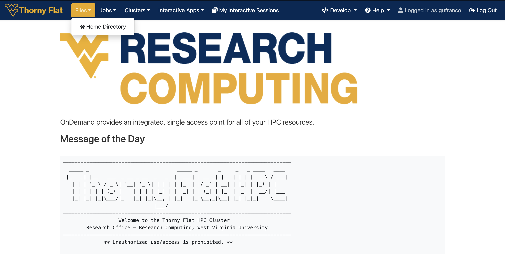
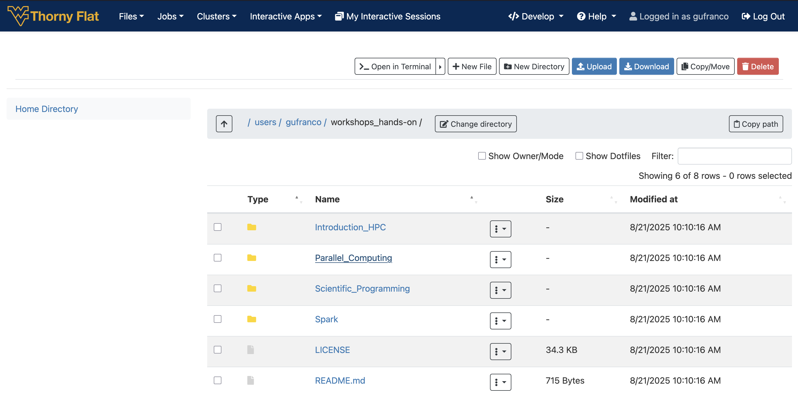
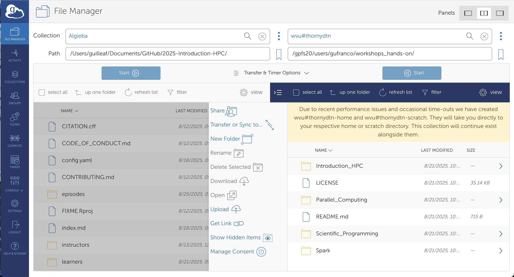
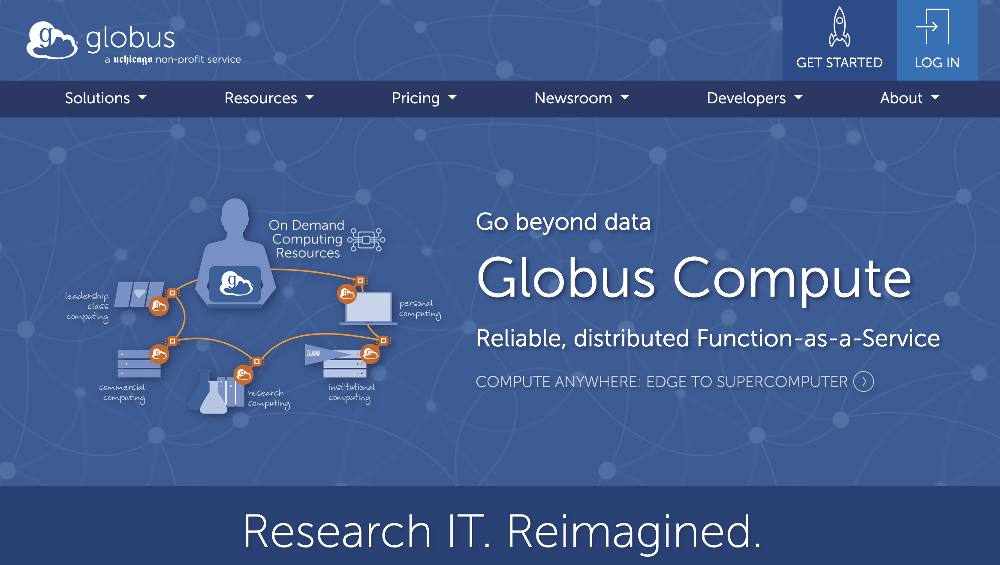
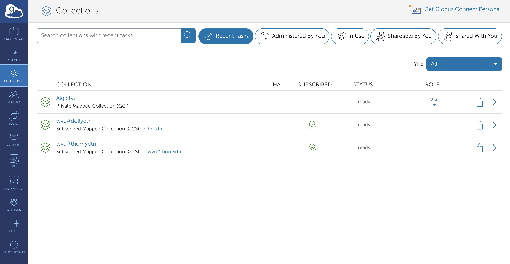

:::::::::::::::::::::::::::::::::::::: questions

- "What is supercomputing?"
- "Why I could need a supercomputer?"
- "How a supercomputer compares with my desktop or laptop computer?"

::::::::::::::::::::::::::::::::::::::::::::::::

::::::::::::::::::::::::::::::::::::: objectives

- "Learn the main concepts of supercomputers"
- "Learn some use cases that justify using supercomputers."
- "Learn about HPC cluster a major category of supercomputers."

::::::::::::::::::::::::::::::::::::::::::::::::

## Data Transfer

Copying files and folders in and out of an HPC cluster is a routine task for HPC users. Users need to move input data to the cluster before this data can be processed. The results will be moved out of the cluster in form of files and folders containing text, figures, tables or some other data. The amount of data could be as small as a simple text file with a few lines or as big as a large binary file or several folders summing Giga Bytes of data.

## Open On Demand

For a few small files you can use Open On Demand via the **File Manager** that can be accessed directly from the dashboard.

The Files menu allows one to view and operate on files in the user's home directory. The SCRATCH folder is not accesible from Open On Demand.

You can easily transfer files from one's personal computer to the Thorny Flat through Open OnDemand. For example, to transfer files to one's home directory, click the 'Files' dropdown menu in the top and click on the 'Home Directory' link. Once in your home directory, you can click the blue 'Upload' button in the top right corner of the file manager window and pop up will open to browse and upload files from your personal computer.

{alt="Open On Demand - Dashboard"}

{alt="Open On Demand - File Manager"}

## SFT

SFTP (Secure File Transfer Protocol) provides a secure way to transfer files between a local system and a remote server. The commands used within an SFTP session are similar to standard Unix-like shell commands but are specific to managing files and directories on both the local and remote systems.

Research Computing a dedicated server for transferring files to/from Thorny Flat. This is a low level and scriptable interface.

### Connecting

Initiates an SFTP connection to the specified remote host using the given username.  

```text
~$ sftp <username>@tf-data.hpc.wvu.edu 
```

This works very similar to a SSH connection. You need to enter the password followed by the MFA (DUO in 2025). Once your credentials are accepted you land on a prompt like this:

```text
Connected to tf-data.hpc.wvu.edu.
sftp> 
```

From this interface you execute commands that allow you to list the remote files, download and upload files and recursive commands for operating with entire folders.

### Navigation and Listing

The SFTP protocol offers commands to interact with the remote and local filesystems. There are commands like `ls`, `cd` and `pwd` operating on the remote side and commands with the prefix `l` such as `lls`, `lcd` and `lpwd` that will do the equivalent operation on the local filesystem.

This is the list of commands for both remote and local operation:

- `ls`: Lists files and directories on the remote system.
- `lls`: Lists files and directories on the local system.
- `cd [directory]`: Changes the current working directory on the remote system.
- `lcd [directory]`: Changes the current working directory on the local system.
- `pwd`: Displays the current working directory on the remote system.
- `lpwd`: Displays the current working directory on the local system.

### File Transfer

SFT provides commands to download (get) or upload files (put) and there are commands for one, several and entire folders.

- `get [remote_file] [local_path]`: Downloads a file from the remote system to the local system.
- `put [local_file] [remote_path]`: Uploads a file from the local system to the remote system.
- `mget [remote_files]`: Downloads multiple files from the remote system.
- `mput [local_files]`: Uploads multiple files to the remote system.
- `get -R [remote_directory]`: Recursively downloads a directory and its contents.
- `put -R [local_directory]`: Recursively uploads a directory and its contents.

### File and Directory Management

Same as on Unix-like shell commands, we have commands for creating folders, both on the remote and local filesystem, remove and rename files and change permissions for files on the remote system.

- `mkdir [directory]`: Creates a new directory on the remote system.
- `lmkdir [directory]`: Creates a new directory on the local system.
- `rmdir [directory]`: Removes an empty directory on the remote system.
- `rm [file]`: Deletes a file on the remote system.
- `rename [old_path] [new_path]`: Renames a file or directory on the remote system.
- `chmod [mode] [path]`: Changes file permissions on the remote system.
- `chown [owner] [path]`: Changes the owner of a file on the remote system.
- `chgrp [group] [path]`: Changes the group of a file on the remote system.

### Help and finish session

- `help`: Displays a list of available SFTP commands.
- `exit`, `quit`, or `bye`: Terminates the SFTP session.

### SFT from a GUI interface

For users who are more comfortable with Graphical User Interfaces, you may want to utilize one of the following clients:

- [WINSCP](https://winscp.net/eng/index.php) WinSCP is a popular SFTP client and FTP client for Microsoft Windows! Copy file between a local computer and remote servers using FTP, FTPS, SCP, SFTP, WebDAV or S3 file transfer protocols.

- [FILEZILLA](https://filezilla-project.org/) FileZilla Client not only supports FTP, but also FTP over TLS (FTPS) and SFTP. It is open source software distributed free of charge under the terms of the GNU General Public License. It support several OSes such as Windows, macOS and Linux.

## Globus Online

Globus Online is the preferred method for transferring files to, from, and between HPC clusters. There are several advantages to using Globus compared to other methods that will be covered on File Transfer Section: We can summarize the advantages as:

- Globus works from a web browser, not need to learn commands for a terminal.

- Transfers are done in the background so users do not need to keep the browser open. The transfer happens behind the curtains.

- Auto performance tuning to ensure the data is transferred as quickly as possible. One can expect a speedup of at least 2x over traditional transfer methods.

- Transfers can work in parallel, and data could be encrypted during transfer.

- The integrity of the transfer can be ensured via checksum methods (Hashes).

- Transfers are automatically restarted after a failed or stopped connection.

- Ability to only transfer files that have yet to be transferred (similar to rsync).

{alt="Globus Online"}

### Connecting to the Globus Web App

To be able to move data in and out the HPC cluster to your own computer, there are two tasks to be completed. Link Globus to your personal WVU account so you can access the end points to our clusters and download and install “Globus Connect Personal” which is a small piece of software that will transfor your own computer into an endpoint where you can interchange data with the HPC cluster.

The steps are very simple all from your web browser and after a few minutes you will have setup the end points and will be able to tranfer files. The first step is to connect [Globus Homepage](https://www.globus.org).

Once the initial page of globus is displayed, clic on the top right corner over Log in

{alt="Globus Online"}

Once you are authenticated you end on the Globus File Manager. There are several options on your left and three ways of showing panels on the top right.

The next step is to install Globus Connect Personal. The application to convert your own computer into a endpoint. Click on Collections on the left side bar

On the top right corner you will see a link to Get Globus Connect Personal. Click there to go to the Download page for the software.

{alt="Globus Online Collections"}

Once you have installed the Globus Connect Personal you are ready to download files from/to your computer to/from the remote machine.


::::::::::::::::::::::::::::::::::::: keypoints

- "Supercomputers are far more powerful than desktop computers"
- "Most supercomputers today are HPC clusters"
- "Supercomputers are intended to run large calculations or simulations that takes days or weeks to complete"
- "HPC clusters are aggregates of machines that operate as a single entity to provide computational power to many users"

::::::::::::::::::::::::::::::::::::::::::::::::
